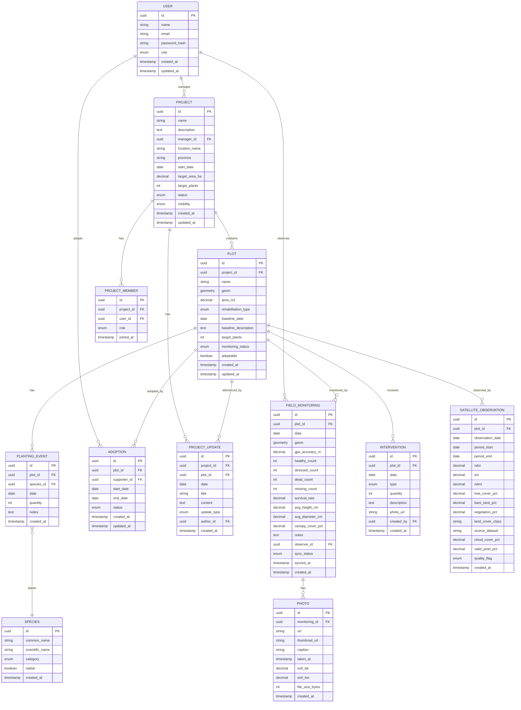

# REHABTRACK — Data Model v0.2

> Referensi utama untuk seluruh entity, relationship, enum, dan constraint database.
> Database: PostgreSQL + PostGIS

---

## Entity Relationship Diagram



---

## Enum Definitions

### UserRole
```sql
CREATE TYPE user_role AS ENUM (
    'SUPER_ADMIN',
    'PROJECT_MANAGER',
    'FIELD_OFFICER',
    'VIEWER',
    'ADOPTER'
);
```

### ProjectStatus
```sql
CREATE TYPE project_status AS ENUM (
    'PLANNING',
    'ACTIVE',
    'COMPLETED',
    'SUSPENDED'
);
```

### ProjectVisibility
```sql
CREATE TYPE project_visibility AS ENUM (
    'PUBLIC',
    'PRIVATE'
);
```

### RehabilitationType
```sql
CREATE TYPE rehabilitation_type AS ENUM (
    'REFORESTATION',
    'AGROFORESTRY',
    'MANGROVE_RESTORATION',
    'RIPARIAN_RESTORATION',
    'MINE_RECLAMATION',
    'WATERSHED_REHABILITATION',
    'OTHER'
);
```

### MonitoringStatus (Plot)
```sql
CREATE TYPE monitoring_status AS ENUM (
    'RECOVERING',   -- Green
    'MONITORING',   -- Yellow
    'AT_RISK'       -- Red
);
```

### PlantCondition
```sql
CREATE TYPE plant_condition AS ENUM (
    'HEALTHY',
    'STRESSED',
    'DEAD',
    'MISSING',
    'UNKNOWN'
);
```

### SpeciesCategory
```sql
CREATE TYPE species_category AS ENUM (
    'TREE',
    'SHRUB',
    'GRASS',
    'MANGROVE',
    'OTHER'
);
```

### InterventionType
```sql
CREATE TYPE intervention_type AS ENUM (
    'PLANTING',
    'REPLANTING',
    'MAINTENANCE',
    'FERTILIZATION',
    'WATERING',
    'PEST_CONTROL',
    'OTHER'
);
```

### SyncStatus
```sql
CREATE TYPE sync_status AS ENUM (
    'PENDING',
    'SYNCED',
    'FAILED'
);
```

### QualityFlag (Satellite)
```sql
CREATE TYPE quality_flag AS ENUM (
    'HIGH',
    'MEDIUM',
    'LOW'
);
```

### AdoptionStatus
```sql
CREATE TYPE adoption_status AS ENUM (
    'ACTIVE',
    'EXPIRED',
    'CANCELLED'
);
```

### UpdateType (Project Update)
```sql
CREATE TYPE update_type AS ENUM (
    'PROJECT_STORY',
    'FOREST_JOURNAL',
    'MONITORING_UPDATE',
    'IMPACT_REPORT',
    'GENERAL'
);
```

### ProjectMemberRole
```sql
CREATE TYPE project_member_role AS ENUM (
    'MANAGER',
    'FIELD_OFFICER',
    'VIEWER'
);
```

---

## Table Definitions (SQL)

### users (public.users profile table linked to Supabase Auth)
```sql
CREATE TABLE public.users (
    id              UUID PRIMARY KEY REFERENCES auth.users(id) ON DELETE CASCADE,
    name            VARCHAR(255) NOT NULL,
    email           VARCHAR(255) NOT NULL UNIQUE,
    role            user_role NOT NULL DEFAULT 'VIEWER',
    avatar_url      VARCHAR(500),
    created_at      TIMESTAMPTZ NOT NULL DEFAULT NOW(),
    updated_at      TIMESTAMPTZ NOT NULL DEFAULT NOW()
);

CREATE INDEX idx_users_email ON public.users(email);

-- Trigger to automatically create public.users profile when auth.users is registered
CREATE OR REPLACE FUNCTION public.handle_new_user()
RETURNS TRIGGER AS $$
BEGIN
    INSERT INTO public.users (id, name, email, role)
    VALUES (
        NEW.id,
        COALESCE(NEW.raw_user_meta_data->>'name', split_part(NEW.email, '@', 1)),
        NEW.email,
        'VIEWER'
    );
    RETURN NEW;
END;
$$ LANGUAGE plpgsql SECURITY DEFINER;

CREATE TRIGGER on_auth_user_created
    AFTER INSERT ON auth.users
    FOR EACH ROW EXECUTE FUNCTION public.handle_new_user();
```

### projects
```sql
CREATE TABLE projects (
    id              UUID PRIMARY KEY DEFAULT gen_random_uuid(),
    name            VARCHAR(255) NOT NULL,
    description     TEXT,
    manager_id      UUID NOT NULL REFERENCES users(id),
    location_name   VARCHAR(255) NOT NULL,
    province        VARCHAR(100) NOT NULL,
    start_date      DATE NOT NULL,
    target_area_ha  DECIMAL(10,2),
    target_plants   INTEGER,
    status          project_status NOT NULL DEFAULT 'PLANNING',
    visibility      project_visibility NOT NULL DEFAULT 'PRIVATE',
    created_at      TIMESTAMPTZ NOT NULL DEFAULT NOW(),
    updated_at      TIMESTAMPTZ NOT NULL DEFAULT NOW()
);

CREATE INDEX idx_projects_manager ON projects(manager_id);
CREATE INDEX idx_projects_status ON projects(status);
CREATE INDEX idx_projects_visibility ON projects(visibility);
```

### project_members
```sql
CREATE TABLE project_members (
    id          UUID PRIMARY KEY DEFAULT gen_random_uuid(),
    project_id  UUID NOT NULL REFERENCES projects(id) ON DELETE CASCADE,
    user_id     UUID NOT NULL REFERENCES users(id),
    role        project_member_role NOT NULL DEFAULT 'VIEWER',
    joined_at   TIMESTAMPTZ NOT NULL DEFAULT NOW(),
    UNIQUE(project_id, user_id)
);

CREATE INDEX idx_project_members_project ON project_members(project_id);
CREATE INDEX idx_project_members_user ON project_members(user_id);
```

### plots
```sql
CREATE TABLE plots (
    id                    UUID PRIMARY KEY DEFAULT gen_random_uuid(),
    project_id            UUID NOT NULL REFERENCES projects(id) ON DELETE CASCADE,
    name                  VARCHAR(255) NOT NULL,
    geom                  GEOMETRY(Polygon, 4326) NOT NULL,
    area_m2               DECIMAL(12,2) NOT NULL,
    rehabilitation_type   rehabilitation_type NOT NULL,
    baseline_date         DATE NOT NULL,
    baseline_description  TEXT,
    target_plants         INTEGER,
    monitoring_status     monitoring_status NOT NULL DEFAULT 'MONITORING',
    adoptable             BOOLEAN NOT NULL DEFAULT FALSE,
    created_at            TIMESTAMPTZ NOT NULL DEFAULT NOW(),
    updated_at            TIMESTAMPTZ NOT NULL DEFAULT NOW()
);

CREATE INDEX idx_plots_project ON plots(project_id);
CREATE INDEX idx_plots_geom ON plots USING GIST(geom);
CREATE INDEX idx_plots_status ON plots(monitoring_status);
```

### species
```sql
CREATE TABLE species (
    id              UUID PRIMARY KEY DEFAULT gen_random_uuid(),
    common_name     VARCHAR(255) NOT NULL,
    scientific_name VARCHAR(255),
    category        species_category NOT NULL DEFAULT 'TREE',
    native          BOOLEAN DEFAULT TRUE,
    created_at      TIMESTAMPTZ NOT NULL DEFAULT NOW()
);

CREATE INDEX idx_species_name ON species(common_name);
```

### planting_events
```sql
CREATE TABLE planting_events (
    id          UUID PRIMARY KEY DEFAULT gen_random_uuid(),
    plot_id     UUID NOT NULL REFERENCES plots(id) ON DELETE CASCADE,
    species_id  UUID NOT NULL REFERENCES species(id),
    date        DATE NOT NULL,
    quantity    INTEGER NOT NULL CHECK (quantity > 0),
    notes       TEXT,
    created_at  TIMESTAMPTZ NOT NULL DEFAULT NOW()
);

CREATE INDEX idx_planting_events_plot ON planting_events(plot_id);
CREATE INDEX idx_planting_events_date ON planting_events(date);
```

### field_monitorings
```sql
CREATE TABLE field_monitorings (
    id                UUID PRIMARY KEY DEFAULT gen_random_uuid(),
    plot_id           UUID NOT NULL REFERENCES plots(id) ON DELETE CASCADE,
    date              DATE NOT NULL,
    geom              GEOMETRY(Point, 4326) NOT NULL,
    gps_accuracy_m    DECIMAL(6,2) NOT NULL,
    healthy_count     INTEGER NOT NULL DEFAULT 0 CHECK (healthy_count >= 0),
    stressed_count    INTEGER NOT NULL DEFAULT 0 CHECK (stressed_count >= 0),
    dead_count        INTEGER NOT NULL DEFAULT 0 CHECK (dead_count >= 0),
    missing_count     INTEGER NOT NULL DEFAULT 0 CHECK (missing_count >= 0),
    survival_rate     DECIMAL(5,2) GENERATED ALWAYS AS (
        CASE
            WHEN (healthy_count + stressed_count + dead_count + missing_count) = 0 THEN NULL
            ELSE (healthy_count::DECIMAL / (healthy_count + stressed_count + dead_count + missing_count)) * 100
        END
    ) STORED,
    avg_height_cm     DECIMAL(8,2) CHECK (avg_height_cm IS NULL OR avg_height_cm > 0),
    avg_diameter_cm   DECIMAL(8,2) CHECK (avg_diameter_cm IS NULL OR avg_diameter_cm > 0),
    canopy_cover_pct  DECIMAL(5,2) CHECK (canopy_cover_pct IS NULL OR (canopy_cover_pct >= 0 AND canopy_cover_pct <= 100)),
    notes             TEXT,
    observer_id       UUID NOT NULL REFERENCES users(id),
    sync_status       sync_status NOT NULL DEFAULT 'SYNCED',
    synced_at         TIMESTAMPTZ,
    created_at        TIMESTAMPTZ NOT NULL DEFAULT NOW()
);

CREATE INDEX idx_field_monitorings_plot ON field_monitorings(plot_id);
CREATE INDEX idx_field_monitorings_date ON field_monitorings(date);
CREATE INDEX idx_field_monitorings_observer ON field_monitorings(observer_id);
CREATE INDEX idx_field_monitorings_geom ON field_monitorings USING GIST(geom);
```

### photos
```sql
CREATE TABLE photos (
    id              UUID PRIMARY KEY DEFAULT gen_random_uuid(),
    monitoring_id   UUID NOT NULL REFERENCES field_monitorings(id) ON DELETE CASCADE,
    url             VARCHAR(500) NOT NULL,
    thumbnail_url   VARCHAR(500),
    caption         VARCHAR(500),
    taken_at        TIMESTAMPTZ,
    exif_lat        DECIMAL(10,7),
    exif_lon        DECIMAL(10,7),
    file_size_bytes INTEGER,
    created_at      TIMESTAMPTZ NOT NULL DEFAULT NOW()
);

CREATE INDEX idx_photos_monitoring ON photos(monitoring_id);
```

### interventions
```sql
CREATE TABLE interventions (
    id          UUID PRIMARY KEY DEFAULT gen_random_uuid(),
    plot_id     UUID NOT NULL REFERENCES plots(id) ON DELETE CASCADE,
    date        DATE NOT NULL,
    type        intervention_type NOT NULL,
    quantity    INTEGER CHECK (quantity IS NULL OR quantity > 0),
    description TEXT NOT NULL,
    photo_url   VARCHAR(500),
    created_by  UUID NOT NULL REFERENCES users(id),
    created_at  TIMESTAMPTZ NOT NULL DEFAULT NOW()
);

CREATE INDEX idx_interventions_plot ON interventions(plot_id);
CREATE INDEX idx_interventions_date ON interventions(date);
CREATE INDEX idx_interventions_type ON interventions(type);
```

### satellite_observations
```sql
CREATE TABLE satellite_observations (
    id                UUID PRIMARY KEY DEFAULT gen_random_uuid(),
    plot_id           UUID NOT NULL REFERENCES plots(id) ON DELETE CASCADE,
    observation_date  DATE NOT NULL,
    period_start      DATE NOT NULL,
    period_end        DATE NOT NULL,
    ndvi              DECIMAL(6,4) CHECK (ndvi IS NULL OR (ndvi >= -1 AND ndvi <= 1)),
    evi               DECIMAL(6,4) CHECK (evi IS NULL OR (evi >= -1 AND evi <= 1)),
    ndmi              DECIMAL(6,4) CHECK (ndmi IS NULL OR (ndmi >= -1 AND ndmi <= 1)),
    tree_cover_pct    DECIMAL(5,2) CHECK (tree_cover_pct IS NULL OR (tree_cover_pct >= 0 AND tree_cover_pct <= 100)),
    bare_land_pct     DECIMAL(5,2) CHECK (bare_land_pct IS NULL OR (bare_land_pct >= 0 AND bare_land_pct <= 100)),
    vegetation_pct    DECIMAL(5,2) CHECK (vegetation_pct IS NULL OR (vegetation_pct >= 0 AND vegetation_pct <= 100)),
    land_cover_class  VARCHAR(100),
    source_dataset    VARCHAR(255) NOT NULL,
    cloud_cover_pct   DECIMAL(5,2) NOT NULL CHECK (cloud_cover_pct >= 0 AND cloud_cover_pct <= 100),
    valid_pixel_pct   DECIMAL(5,2) NOT NULL CHECK (valid_pixel_pct >= 0 AND valid_pixel_pct <= 100),
    quality_flag      quality_flag NOT NULL DEFAULT 'MEDIUM',
    created_at        TIMESTAMPTZ NOT NULL DEFAULT NOW()
);

CREATE INDEX idx_satellite_obs_plot ON satellite_observations(plot_id);
CREATE INDEX idx_satellite_obs_date ON satellite_observations(observation_date);
CREATE INDEX idx_satellite_obs_quality ON satellite_observations(quality_flag);
```

### adoptions
```sql
CREATE TABLE adoptions (
    id              UUID PRIMARY KEY DEFAULT gen_random_uuid(),
    plot_id         UUID NOT NULL REFERENCES plots(id) ON DELETE CASCADE,
    supporter_id    UUID NOT NULL REFERENCES users(id),
    start_date      DATE NOT NULL DEFAULT CURRENT_DATE,
    end_date        DATE,
    status          adoption_status NOT NULL DEFAULT 'ACTIVE',
    created_at      TIMESTAMPTZ NOT NULL DEFAULT NOW(),
    updated_at      TIMESTAMPTZ NOT NULL DEFAULT NOW()
);

CREATE INDEX idx_adoptions_plot ON adoptions(plot_id);
CREATE INDEX idx_adoptions_supporter ON adoptions(supporter_id);
CREATE INDEX idx_adoptions_status ON adoptions(status);
```

### project_updates
```sql
CREATE TABLE project_updates (
    id          UUID PRIMARY KEY DEFAULT gen_random_uuid(),
    project_id  UUID NOT NULL REFERENCES projects(id) ON DELETE CASCADE,
    plot_id     UUID REFERENCES plots(id) ON DELETE SET NULL,
    date        DATE NOT NULL,
    title       VARCHAR(255) NOT NULL,
    content     TEXT NOT NULL,
    update_type update_type NOT NULL DEFAULT 'GENERAL',
    author_id   UUID NOT NULL REFERENCES users(id),
    created_at  TIMESTAMPTZ NOT NULL DEFAULT NOW()
);

CREATE INDEX idx_project_updates_project ON project_updates(project_id);
CREATE INDEX idx_project_updates_date ON project_updates(date);
CREATE INDEX idx_project_updates_type ON project_updates(update_type);
```

### audit_logs
```sql
CREATE TABLE audit_logs (
    id          UUID PRIMARY KEY DEFAULT gen_random_uuid(),
    user_id     UUID REFERENCES users(id),
    action      VARCHAR(50) NOT NULL,  -- CREATE, UPDATE, DELETE
    entity_type VARCHAR(50) NOT NULL,  -- projects, plots, field_monitorings, etc.
    entity_id   UUID NOT NULL,
    old_values  JSONB,
    new_values  JSONB,
    ip_address  INET,
    created_at  TIMESTAMPTZ NOT NULL DEFAULT NOW()
);

CREATE INDEX idx_audit_logs_user ON audit_logs(user_id);
CREATE INDEX idx_audit_logs_entity ON audit_logs(entity_type, entity_id);
CREATE INDEX idx_audit_logs_created ON audit_logs(created_at);
```

---

## Validation Rules (Database-Level)

### Spatial Constraints

```sql
-- Ensure monitoring point is within plot polygon
CREATE OR REPLACE FUNCTION check_monitoring_within_plot()
RETURNS TRIGGER AS $$
BEGIN
    IF NOT ST_Within(
        NEW.geom,
        (SELECT geom FROM plots WHERE id = NEW.plot_id)
    ) THEN
        RAISE EXCEPTION 'Monitoring point must be within plot boundary';
    END IF;
    RETURN NEW;
END;
$$ LANGUAGE plpgsql;

CREATE TRIGGER trg_monitoring_within_plot
    BEFORE INSERT OR UPDATE ON field_monitorings
    FOR EACH ROW EXECUTE FUNCTION check_monitoring_within_plot();
```

```sql
-- Ensure coordinates are within Indonesia bounds
CREATE OR REPLACE FUNCTION check_indonesia_bounds()
RETURNS TRIGGER AS $$
DECLARE
    lat DECIMAL;
    lon DECIMAL;
BEGIN
    lat := ST_Y(ST_Centroid(NEW.geom));
    lon := ST_X(ST_Centroid(NEW.geom));
    IF lat < -11 OR lat > 6 OR lon < 95 OR lon > 141 THEN
        RAISE EXCEPTION 'Coordinates must be within Indonesia bounds';
    END IF;
    RETURN NEW;
END;
$$ LANGUAGE plpgsql;

CREATE TRIGGER trg_plot_indonesia_bounds
    BEFORE INSERT OR UPDATE ON plots
    FOR EACH ROW EXECUTE FUNCTION check_indonesia_bounds();
```

### Auto-Calculate Area
```sql
-- Auto-calculate plot area from geometry
CREATE OR REPLACE FUNCTION calculate_plot_area()
RETURNS TRIGGER AS $$
BEGIN
    NEW.area_m2 := ST_Area(NEW.geom::geography);
    RETURN NEW;
END;
$$ LANGUAGE plpgsql;

CREATE TRIGGER trg_calculate_plot_area
    BEFORE INSERT OR UPDATE OF geom ON plots
    FOR EACH ROW EXECUTE FUNCTION calculate_plot_area();
```

### Quality Flag Auto-Calculation
```sql
-- Auto-calculate satellite observation quality flag
CREATE OR REPLACE FUNCTION calculate_quality_flag()
RETURNS TRIGGER AS $$
BEGIN
    IF NEW.cloud_cover_pct > 30 OR NEW.valid_pixel_pct < 70 THEN
        NEW.quality_flag := 'LOW';
    ELSIF NEW.cloud_cover_pct > 15 OR NEW.valid_pixel_pct < 85 THEN
        NEW.quality_flag := 'MEDIUM';
    ELSE
        NEW.quality_flag := 'HIGH';
    END IF;
    RETURN NEW;
END;
$$ LANGUAGE plpgsql;

CREATE TRIGGER trg_quality_flag
    BEFORE INSERT OR UPDATE ON satellite_observations
    FOR EACH ROW EXECUTE FUNCTION calculate_quality_flag();
```

---

## PostGIS Setup (Supabase)

```sql
-- Enable required extensions in Supabase
CREATE EXTENSION IF NOT EXISTS "uuid-ossp";
CREATE EXTENSION IF NOT EXISTS postgis WITH SCHEMA extensions;
CREATE EXTENSION IF NOT EXISTS postgis_topology;
```

---

## Supabase Row Level Security (RLS) Policies

```sql
-- Enable RLS on all operational tables
ALTER TABLE public.users ENABLE ROW LEVEL SECURITY;
ALTER TABLE public.projects ENABLE ROW LEVEL SECURITY;
ALTER TABLE public.project_members ENABLE ROW LEVEL SECURITY;
ALTER TABLE public.plots ENABLE ROW LEVEL SECURITY;
ALTER TABLE public.species ENABLE ROW LEVEL SECURITY;
ALTER TABLE public.planting_events ENABLE ROW LEVEL SECURITY;
ALTER TABLE public.field_monitorings ENABLE ROW LEVEL SECURITY;
ALTER TABLE public.photos ENABLE ROW LEVEL SECURITY;
ALTER TABLE public.interventions ENABLE ROW LEVEL SECURITY;
ALTER TABLE public.satellite_observations ENABLE ROW LEVEL SECURITY;
ALTER TABLE public.adoptions ENABLE ROW LEVEL SECURITY;
ALTER TABLE public.project_updates ENABLE ROW LEVEL SECURITY;

-- ═══════════════════════════════════════════
-- USERS POLICIES
-- ═══════════════════════════════════════════
CREATE POLICY "users_select_authenticated" ON public.users
    FOR SELECT TO authenticated USING (true);

CREATE POLICY "users_update_own" ON public.users
    FOR UPDATE TO authenticated USING (auth.uid() = id);

-- ═══════════════════════════════════════════
-- PROJECTS POLICIES
-- ═══════════════════════════════════════════
CREATE POLICY "projects_select" ON public.projects
    FOR SELECT USING (
        visibility = 'PUBLIC'
        OR id IN (
            SELECT project_id FROM public.project_members
            WHERE user_id = auth.uid()
        )
    );

CREATE POLICY "projects_insert" ON public.projects
    FOR INSERT TO authenticated
    WITH CHECK (auth.uid() = manager_id);

CREATE POLICY "projects_update" ON public.projects
    FOR UPDATE TO authenticated USING (
        id IN (
            SELECT project_id FROM public.project_members
            WHERE user_id = auth.uid() AND role = 'MANAGER'
        )
    );

CREATE POLICY "projects_delete" ON public.projects
    FOR DELETE TO authenticated USING (
        id IN (
            SELECT project_id FROM public.project_members
            WHERE user_id = auth.uid() AND role = 'MANAGER'
        )
    );

-- ═══════════════════════════════════════════
-- PROJECT_MEMBERS POLICIES
-- ═══════════════════════════════════════════
CREATE POLICY "project_members_select" ON public.project_members
    FOR SELECT TO authenticated USING (
        project_id IN (
            SELECT project_id FROM public.project_members WHERE user_id = auth.uid()
        )
    );

CREATE POLICY "project_members_manage" ON public.project_members
    FOR ALL TO authenticated USING (
        project_id IN (
            SELECT project_id FROM public.project_members
            WHERE user_id = auth.uid() AND role = 'MANAGER'
        )
    );

-- ═══════════════════════════════════════════
-- PLOTS POLICIES
-- ═══════════════════════════════════════════
CREATE POLICY "plots_select" ON public.plots
    FOR SELECT USING (
        project_id IN (SELECT id FROM public.projects WHERE visibility = 'PUBLIC')
        OR project_id IN (
            SELECT project_id FROM public.project_members WHERE user_id = auth.uid()
        )
    );

CREATE POLICY "plots_insert" ON public.plots
    FOR INSERT TO authenticated WITH CHECK (
        project_id IN (
            SELECT project_id FROM public.project_members
            WHERE user_id = auth.uid() AND role = 'MANAGER'
        )
    );

CREATE POLICY "plots_update" ON public.plots
    FOR UPDATE TO authenticated USING (
        project_id IN (
            SELECT project_id FROM public.project_members
            WHERE user_id = auth.uid() AND role = 'MANAGER'
        )
    );

-- ═══════════════════════════════════════════
-- FIELD_MONITORINGS & PHOTOS POLICIES
-- ═══════════════════════════════════════════
CREATE POLICY "monitorings_select" ON public.field_monitorings
    FOR SELECT USING (
        plot_id IN (
            SELECT p.id FROM public.plots p
            JOIN public.project_members pm ON pm.project_id = p.project_id
            WHERE pm.user_id = auth.uid()
        )
    );

CREATE POLICY "monitorings_insert" ON public.field_monitorings
    FOR INSERT TO authenticated WITH CHECK (
        plot_id IN (
            SELECT p.id FROM public.plots p
            JOIN public.project_members pm ON pm.project_id = p.project_id
            WHERE pm.user_id = auth.uid() AND pm.role IN ('MANAGER', 'FIELD_OFFICER')
        )
    );

CREATE POLICY "photos_select" ON public.photos
    FOR SELECT USING (
        monitoring_id IN (
            SELECT id FROM public.field_monitorings
        )
    );

CREATE POLICY "photos_insert" ON public.photos
    FOR INSERT TO authenticated WITH CHECK (
        monitoring_id IN (
            SELECT id FROM public.field_monitorings WHERE observer_id = auth.uid()
        )
    );

-- ═══════════════════════════════════════════
-- SATELLITE_OBSERVATIONS (Read by members, written by service_role)
-- ═══════════════════════════════════════════
CREATE POLICY "satellite_obs_select" ON public.satellite_observations
    FOR SELECT USING (
        plot_id IN (
            SELECT p.id FROM public.plots p
            JOIN public.projects pr ON pr.id = p.project_id
            WHERE pr.visibility = 'PUBLIC'
            OR p.project_id IN (
                SELECT project_id FROM public.project_members WHERE user_id = auth.uid()
            )
        )
    );

-- ═══════════════════════════════════════════
-- SPECIES (Public read, Manager write)
-- ═══════════════════════════════════════════
CREATE POLICY "species_select" ON public.species
    FOR SELECT TO authenticated USING (true);

CREATE POLICY "species_insert" ON public.species
    FOR INSERT TO authenticated WITH CHECK (true);
```

---

## Supabase Storage Buckets & Policies

### Buckets
1. `monitoring-photos` (Private bucket — raw field photos with EXIF)
2. `public-photos` (Public bucket — compressed photos with stripped GPS EXIF for public display)

```sql
-- Storage Policies for monitoring-photos
CREATE POLICY "upload_monitoring_photos" ON storage.objects
    FOR INSERT TO authenticated
    WITH CHECK (bucket_id = 'monitoring-photos');

CREATE POLICY "view_monitoring_photos" ON storage.objects
    FOR SELECT TO authenticated
    USING (bucket_id = 'monitoring-photos');

-- Storage Policies for public-photos
CREATE POLICY "view_public_photos" ON storage.objects
    FOR SELECT
    USING (bucket_id = 'public-photos');
```

---

## Supabase Database Functions (RPC)

```sql
-- RPC: Get Project KPI aggregated statistics
CREATE OR REPLACE FUNCTION get_project_kpi(p_project_id UUID)
RETURNS JSON AS $$
DECLARE
    result JSON;
BEGIN
    SELECT json_build_object(
        'total_area_ha', COALESCE(SUM(area_m2) / 10000, 0),
        'total_plots', COUNT(*),
        'total_planted', (
            SELECT COALESCE(SUM(pe.quantity), 0)
            FROM planting_events pe
            JOIN plots pl ON pe.plot_id = pl.id
            WHERE pl.project_id = p_project_id
        ),
        'avg_survival_rate', (
            SELECT COALESCE(AVG(fm.survival_rate), 0)
            FROM field_monitorings fm
            JOIN plots pl ON fm.plot_id = pl.id
            WHERE pl.project_id = p_project_id
            AND fm.id IN (
                SELECT DISTINCT ON (plot_id) id
                FROM field_monitorings
                ORDER BY plot_id, date DESC
            )
        ),
        'plots_recovering', COUNT(*) FILTER (WHERE monitoring_status = 'RECOVERING'),
        'plots_monitoring', COUNT(*) FILTER (WHERE monitoring_status = 'MONITORING'),
        'plots_at_risk', COUNT(*) FILTER (WHERE monitoring_status = 'AT_RISK')
    ) INTO result
    FROM plots
    WHERE project_id = p_project_id;

    RETURN result;
END;
$$ LANGUAGE plpgsql SECURITY DEFINER;
```

---

## Changelog

| Version | Date | Changes |
|---------|------|---------|
| v0.1 | 2026-08-29 | Initial data model from PRD v0.1 |
| v0.2 | 2026-08-29 | Added: PHOTO (separate entity), SPECIES catalog, PROJECT_MEMBER, AUDIT_LOG. Enriched: FIELD_MONITORING (gps_accuracy, sync_status, canopy_cover), SATELLITE_OBSERVATION (period dates, cloud_cover, valid_pixel, quality_flag). Added validation triggers, spatial constraints, auto-calculations. |
| v0.2.1 | 2026-08-29 | **Supabase Integration**: Updated `users` table to reference `auth.users` with `on_auth_user_created` sync trigger. Added full Supabase Row Level Security (RLS) policies, Supabase Storage buckets & policies, and RPC functions (`get_project_kpi`). |
