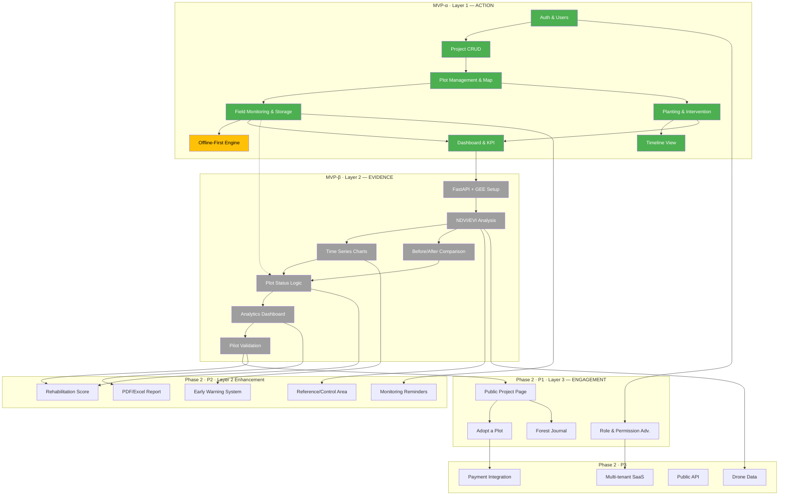

# REHABTRACK — Roadmap Pengembangan v1.0

> **Terakhir diperbarui:** 12 September 2026
> **Status:** Dokumen hidup — diperbarui setiap fase selesai.
> **Referensi:** [PRD v0.2](./PRD_REHABTRACK_v0.2.md) · [MVP Scope](./MVP_SCOPE.md) · [Data Model](./DATA_MODEL.md) · [Technical Spec](./TECHNICAL_SPEC.md)

---

## Daftar Isi

1. [Ringkasan Roadmap](#1-ringkasan-roadmap)
2. [Arsitektur 3 Layer](#2-arsitektur-3-layer)
3. [Fase 1 — MVP-α: Field Data Foundation](#3-fase-1--mvp-α-field-data-foundation)
4. [Fase 2 — MVP-β: Satellite Intelligence](#4-fase-2--mvp-β-satellite-intelligence)
5. [Fase 3 — Phase 2: Scale & Engage](#5-fase-3--phase-2-scale--engage)
6. [Fase 4 — Phase 3: Ecosystem Vision](#6-fase-4--phase-3-ecosystem-vision)
7. [Dependency Graph](#7-dependency-graph)
8. [Risk Checkpoints](#8-risk-checkpoints)
9. [Changelog](#9-changelog)

---

## 1. Ringkasan Roadmap

```
Timeline Overview
═════════════════════════════════════════════════════════════════════════

 MVP-α (Minggu 1–6)          MVP-β (Minggu 7–10)      Phase 2         Phase 3
 ────────────────────        ─────────────────────    ──────────       ──────────
 Field Data Foundation       Satellite Intelligence   Scale & Engage   Ecosystem
                                                                       Vision

 ┌───────────────────┐       ┌──────────────────┐     ┌──────────┐    ┌──────────┐
 │ Auth & Project    │       │ GEE Integration  │     │ Adopt    │    │ Carbon   │
 │ Plot & Map        │       │ Time Series      │     │ Scoring  │    │ ML Risk  │
 │ Monitoring        │──────▶│ Before/After     │────▶│ Warning  │───▶│ Multi-   │
 │ Offline-First     │       │ Analytics        │     │ Report   │    │  tenant  │
 │ Timeline          │       │ Pilot Validation │     │ Public   │    │ Biodiv.  │
 │ Dashboard         │       │                  │     │ API      │    │          │
 └───────────────────┘       └──────────────────┘     └──────────┘    └──────────┘

 LAYER 1 — ACTION             LAYER 2 — EVIDENCE       LAYER 3 — ENGAGEMENT
 (Core MVP)                    (Core MVP)               (Supporting)
```

### Filosofi Pengembangan

> Bangun yang **paling kecil** yang bisa membuktikan value proposition:
> *"Apakah kita bisa menunjukkan bahwa lahan yang direhabilitasi benar-benar mengalami pemulihan?"*

| Prinsip | Penjelasan |
|---------|------------|
| **Evidence over Activity** | Fokus pada bukti pemulihan, bukan jumlah aktivitas |
| **Map First, Data Second** | Lokasi adalah konteks utama setiap data |
| **Time Matters** | Perubahan temporal > snapshot |
| **Field + Satellite** | Dua sumber bukti yang saling melengkapi |
| **Simple Field Workflow** | Cepat, offline-ready, minimal input |
| **Transparent Impact** | Kontribusi dikaitkan dengan proyek/plot dan perkembangan nyata |
| **Explainable Analytics** | Tidak ada angka yang tidak bisa dijelaskan |

---

## 2. Arsitektur 3 Layer

```
┌─────────────────────────────────────────────────────────────────┐
│  LAYER 3 — ENGAGEMENT                                          │
│  Adopt a Plot · Forest Journal · Impact Report · Payment       │
│  Public API · Gamification                                     │
│                                                                 │
│  ⚠️  Tidak boleh menjadi dependency Layer 1 atau 2             │
├─────────────────────────────────────────────────────────────────┤
│  LAYER 2 — EVIDENCE                                            │
│  GEE/Satellite · NDVI/EVI Time Series · Before/After           │
│  Rehabilitation Score · Early Warning · Reference Area          │
│                                                                 │
│  🔧  Core Engine — MVP-β                                       │
├─────────────────────────────────────────────────────────────────┤
│  LAYER 1 — ACTION                                              │
│  Project · Plot · Planting · Monitoring · Geotagging           │
│  Intervention · Offline-First · Timeline · Dashboard           │
│                                                                 │
│  🔧  Core Engine — MVP-α                                       │
└─────────────────────────────────────────────────────────────────┘
```

### Aturan Antar-Layer

1. Layer 1 dan 2 adalah **core engine**. Jangan pernah mencampur logika engagement (Layer 3) ke dalamnya.
2. Layer 3 **tidak boleh** menjadi dependency dari Layer 1 atau 2.
3. Setiap fitur baru harus bisa ditempatkan di salah satu layer. Jika tidak bisa, pertanyakan apakah fitur tersebut masuk scope.

---

## 3. Fase 1 — MVP-α: Field Data Foundation

| Aspek | Detail |
|-------|--------|
| **Durasi** | Minggu 1–6 |
| **Layer** | Layer 1 — ACTION |
| **Status** | ✅ Selesai (MVP-α Selesai) |
| **Goal** | Petugas lapangan dapat mendokumentasikan rehabilitasi lahan secara spasial, dan pengelola dapat melihat progress di dashboard — termasuk saat offline. |

### 3.1 Breakdown Per Minggu

| Minggu | Deliverable | Detail | Status |
|--------|-------------|--------|--------|
| **1** | Setup & Foundation | Supabase project (Singapore `ap-southeast-1`), PostGIS extension, SQL migrations, Next.js 14+ PWA init, design system tokens | ✅ Selesai |
| **2** | Auth & Project Management | Supabase Auth (email/login), `public.users` trigger, Project CRUD + members dengan RLS, project list & detail UI | ✅ Selesai |
| **3** | Plot Management & Map | Plot CRUD dengan GeoJSON/MapLibre GL Draw, auto-area calculation, species catalog, plot detail & status badges | ✅ Selesai |
| **4** | Field Monitoring & Storage | Monitoring form (GPS, counts, canopy), photo upload ke Supabase Storage bucket (`monitoring-photos`), photo gallery, history list | ✅ Selesai |
| **5** | Offline-First Engine | Dexie.js (IndexedDB) local cache, offline monitoring submission, custom PWA service worker, auto-sync queue ke Supabase | ✅ Selesai |
| **6** | Timeline, Dashboard & Polish | Planting & intervention events, timeline view, project KPI RPC (`get_project_kpi`), overview dashboard, CSV export, test pass | ✅ Selesai |

### 3.2 Stack Teknologi MVP-α

| Komponen | Teknologi |
|----------|-----------|
| Frontend | Next.js 14 (App Router) + React + TypeScript |
| Backend & Database | Supabase Cloud (PostgreSQL + PostGIS, Auth, Storage, RLS) |
| Map Engine | Leaflet & MapLibre GL JS |
| Offline | Dexie.js (IndexedDB) + Custom Lightweight Service Worker |
| Data Administrasi | GeoJSON (`data/map/BOUNDARY/`) |

### 3.3 Deliverable MVP-α

- [x] Web/PWA app dengan Supabase Auth
- [x] CRUD project + assign member dengan RLS security
- [x] CRUD plot dengan polygon di MapLibre map
- [x] Form monitoring lapangan + GPS + multi-photo ke Supabase Storage
- [x] Offline data entry (IndexedDB) + auto-sync
- [x] Planting event & intervention log with timeline
- [x] Dashboard: project overview, plot status map, monitoring history, KPI
- [x] CSV export monitoring data & plot summary (UTF-8 BOM)

### 3.4 Success Criteria MVP-α

- [x] 3 test projects berhasil dibuat dengan polygon plot
- [x] Monitoring lapangan mendukung penginputan online & offline (disimpan ke IndexedDB → sync ke Supabase)
- [x] Foto tersimpan di Supabase Storage dan ter-display di monitoring history
- [x] Dashboard menampilkan summary KPI via RPC function
- [x] Map menampilkan semua plot dengan polygon interaktif
- [x] Data export CSV berfungsi (format Excel UTF-8 BOM)

---

## 4. Fase 2 — MVP-β: Satellite Intelligence

| Aspek | Detail |
|-------|--------|
| **Durasi** | Minggu 7–10 |
| **Layer** | Layer 2 — EVIDENCE |
| **Status** | ⬜ Belum dimulai |
| **Goal** | Sistem dapat mengambil data satelit dari GEE via FastAPI backend, menampilkan time series, dan membandingkan baseline vs current — memberikan evidence of recovery yang terukur. |
| **Prasyarat** | MVP-α selesai dan stabil |

### 4.1 Breakdown Per Minggu

| Minggu | Deliverable | Detail | Status |
|--------|-------------|--------|--------|
| **7** | GEE Integration (FastAPI) | FastAPI service setup, GEE service account init, NDVI & EVI composite analysis, store results ke Supabase | ⬜ |
| **8** | Time Series + Comparison | Time series line chart (NDVI, EVI via Recharts), before/after comparison table, seasonal awareness checks | ⬜ |
| **9** | Analytics Dashboard & Plot Status | Evaluation dashboard, multi-indicator plot status logic (`RECOVERING` / `MONITORING` / `AT_RISK`), KPI enhancement | ⬜ |
| **10** | Pilot Validation & Launch Polish | Pilot 1 lokasi nyata di Banjarnegara, field data collection, validate field vs satellite, bug fixing, documentation | ⬜ |

### 4.2 Stack Teknologi Tambahan MVP-β

| Komponen | Teknologi | Catatan |
|----------|-----------|---------|
| GEE Backend | FastAPI (Python 3.11+) | Async-first, GEE Python API |
| Task Queue | Celery + Redis | Untuk async GEE analysis tasks |
| Charts | Recharts | Time series & comparison charts |
| Remote Sensing | Google Earth Engine (Python API) | Via FastAPI backend, bukan client-side |

### 4.3 Detail Teknis GEE

#### Dataset Utama

| Dataset | Resolusi | Revisit | Digunakan Untuk |
|---------|----------|---------|-----------------|
| **Sentinel-2 L2A** | 10m | 5 hari | NDVI, EVI, visual RGB |
| **Landsat 8/9 L2** | 30m | 16 hari | Time series jangka panjang |
| **Dynamic World** | 10m | ~daily | Land cover classification |
| **Hansen GFC** | 30m | Annual | Tree cover, forest loss/gain |

#### Indikator MVP-β

| Indikator | Sumber | Tujuan |
|-----------|--------|--------|
| NDVI | Sentinel-2 | Kondisi/kepadatan vegetasi |
| EVI | Sentinel-2 | Indikator tambahan vegetasi |
| Land Cover | Dynamic World | Perubahan kelas tutupan lahan |

#### Cloud Masking Strategy

> ⚠️ **Indonesia memiliki tutupan awan rata-rata 60-80%.** Strategi:

1. **Per-scene cloud masking** → QA60 band (Sentinel-2) / QA_PIXEL (Landsat)
2. **Temporal composite** → median composite per periode (monthly/quarterly)
3. **Minimum valid pixels** → jika < 70% pixel valid, tandai `LOW` quality
4. **Multi-sensor fusion** → gabungkan Sentinel-2 dan Landsat

#### Spatial Consideration

| Ukuran Plot | Pixel Count (10m) | Rekomendasi |
|---|---|---|
| < 500 m² | < 5 pixel | ⚠️ Terlalu kecil, andalkan field data |
| 500–5000 m² | 5–50 pixel | Sentinel-2 OK, interpretasi hati-hati |
| > 5000 m² | > 50 pixel | Sentinel-2 reliable, Landsat OK |
| > 1 ha | > 100 pixel | Semua dataset reliable |

### 4.4 Fitur Detail

#### F06 — GEE Satellite Analysis

```
Flow:
User request analysis → FastAPI endpoint → Celery task →
GEE Python API → Extract NDVI/EVI/LandCover →
Store ke Supabase `satellite_observations` → Return ke frontend
```

**Satellite Observation Entity:**

| Field | Type | Catatan |
|---|---|---|
| `plot_id` | FK → Plot | |
| `observation_date` | date | Center date composite |
| `period_start` / `period_end` | date | Periode composite |
| `ndvi` | decimal | -1 to 1 |
| `evi` | decimal | -1 to 1 |
| `tree_cover_pct` | decimal | 0-100 |
| `bare_land_pct` | decimal | 0-100 |
| `vegetation_pct` | decimal | 0-100 |
| `land_cover_class` | string | Dari Dynamic World |
| `source_dataset` | string | e.g., `COPERNICUS/S2_SR_HARMONIZED` |
| `cloud_cover_pct` | decimal | |
| `valid_pixel_pct` | decimal | % pixel valid setelah cloud masking |
| `quality_flag` | enum | `HIGH` / `MEDIUM` / `LOW` |

#### F07 — Time Series Visualization

| Parameter | Options |
|---|---|
| Plot | Single plot atau compare multiple plots |
| Indicator | NDVI, EVI, Tree Cover, Bare Land, Survival Rate |
| Date Range | Custom range |
| Granularity | Monthly / Quarterly / Annual |

**Visualisasi:**
- **Primary:** Line chart dengan data points
- **Secondary:** Area chart untuk land cover composition
- **Overlay:** Intervention markers pada timeline (penanaman, penyulaman, dll)
- **Annotation:** Seasonal bands (wet/dry season) untuk konteks

#### F08 — Before/After Comparison

```
Contoh Output:

Baseline: Jan-Dec 2024
Current:  Jan-Dec 2026

┌────────────┬──────────┬─────────┬────────────────┬───────┐
│ Indicator  │ Baseline │ Current │ Change         │ Trend │
├────────────┼──────────┼─────────┼────────────────┼───────┤
│ NDVI       │ 0.21     │ 0.46    │ +0.25 (+119%)  │  ↑    │
│ Tree Cover │ 8%       │ 27%     │ +19pp          │  ↑    │
│ Bare Land  │ 62%      │ 34%     │ -28pp          │  ↓ ✓  │
│ Survival   │ —        │ 88%     │ —              │  —    │
└────────────┴──────────┴─────────┴────────────────┴───────┘
```

#### F09 — Plot Status Evaluation

| Status | Warna | Kriteria |
|---|---|---|
| `RECOVERING` | 🟢 Green | NDVI trend positif **DAN** survival rate > 70% **DAN** land cover membaik |
| `MONITORING` | 🟡 Yellow | Mixed signals **ATAU** data tidak cukup **ATAU** perlu inspeksi |
| `AT_RISK` | 🔴 Red | NDVI trend negatif **ATAU** survival rate < 50% **ATAU** land cover memburuk |

> ⚠️ Status **TIDAK BOLEH** ditentukan hanya dari satu indikator. Minimal 2 sumber bukti (field + satellite) harus dikombinasikan.

### 4.5 Deliverable MVP-β

- [ ] GEE analysis untuk plot (NDVI, EVI, Land Cover)
- [ ] Time series chart per plot per indicator
- [ ] Before/After comparison (baseline vs current)
- [ ] Plot status determination (multi-indicator)
- [ ] Enhanced dashboard dengan satellite data
- [ ] 1 pilot location validated (Banjarnegara)

### 4.6 Success Criteria MVP-β

- [ ] GEE berhasil menganalisis NDVI/EVI untuk minimal 5 plot di pilot site
- [ ] Time series chart menampilkan minimal 3 data points
- [ ] Before/After comparison menampilkan delta yang bermakna
- [ ] Plot status logic berjalan (GREEN/YELLOW/RED)
- [ ] Field data dan satellite data ditampilkan berdampingan
- [ ] 1 lokasi nyata tervalidasi end-to-end

---

## 5. Fase 3 — Phase 2: Scale & Engage

| Aspek | Detail |
|-------|--------|
| **Durasi** | Post-MVP (estimasi 3–6 bulan) |
| **Layer** | Layer 2 (lanjutan) + Layer 3 — ENGAGEMENT |
| **Status** | ⬜ Backlog |
| **Goal** | Memperkuat analitik, membuka akses publik, dan membangun community engagement. |
| **Prasyarat** | MVP-β selesai, pilot validation berhasil |

### 5.1 Prioritas P1 — High Priority

> Fitur-fitur yang langsung memperkuat value proposition dan membuka engagement.

---

#### F10 — Public Project Page

| Aspek | Detail |
|---|---|
| **Effort** | Medium (2–4 minggu) |
| **Layer** | Layer 3 — ENGAGEMENT |
| **Deskripsi** | Halaman publik untuk project yang `visibility = PUBLIC`. Menampilkan story, plot cards, progress, dan updates. |
| **Dependensi** | MVP-β selesai |

**Scope:**
- [ ] Public landing page per project
- [ ] Plot cards dengan status badge & thumbnail foto
- [ ] Progress summary (luas, tanaman, survival rate)
- [ ] Map view dengan polygon plot (koordinat di-mask untuk keamanan)
- [ ] SEO-friendly URL (`/projects/{slug}`)

**Privacy Rules:**
- Koordinat plot pada project **PRIVATE** tidak boleh diekspos ke publik
- Foto petugas → strip EXIF GPS metadata sebelum display ke publik

---

#### F11 — Adopt a Plot (Tanpa Payment)

| Aspek | Detail |
|---|---|
| **Effort** | Large (4–6 minggu) |
| **Layer** | Layer 3 — ENGAGEMENT |
| **Deskripsi** | Mekanisme engagement di mana publik dapat "mengadopsi" sebuah plot dan mengikuti perkembangannya. Belum ada transaksi finansial. |
| **Dependensi** | F10 (Public Project Page) |

**Scope:**
- [ ] Adopter registration & profile
- [ ] Browse & select adoptable plots
- [ ] "Adopt" action (commitment/interest, bukan payment)
- [ ] Adopter dashboard — lihat progress plot yang diadopsi
- [ ] Notifikasi saat ada monitoring update baru
- [ ] Adopter count per plot

**Model Adopsi:**

| Aspek | Definisi |
|---|---|
| Bentuk adopsi | Dukungan moral & komitmen mengikuti perkembangan |
| Durasi | Minimal 1 tahun, renewable |
| Batas adopter | Tidak dibatasi per plot (shared adoption) |
| Jika plot gagal | Adopter diberitahu, diberi opsi pindah ke plot lain |

---

#### F12 — Forest Journal

| Aspek | Detail |
|---|---|
| **Effort** | Small (1–2 minggu) |
| **Layer** | Layer 3 — ENGAGEMENT |
| **Deskripsi** | Update naratif tentang progres project/plot untuk publik. Konten engagement berupa cerita, foto, dan perkembangan. |
| **Dependensi** | F10 (Public Project Page) |

**Scope:**
- [ ] Create/edit journal entries (project manager)
- [ ] Rich text editor dengan foto embedding
- [ ] Journal feed per project & per plot
- [ ] Adopter menerima notifikasi journal baru
- [ ] Public-facing journal page

---

#### F24 — Role & Permission Management (Advanced)

| Aspek | Detail |
|---|---|
| **Effort** | Medium (2–4 minggu) |
| **Layer** | Layer 1 — ACTION (enhancement) |
| **Deskripsi** | Sistem role & permission yang lebih granular untuk mendukung multi-organisasi. |
| **Dependensi** | MVP-α Auth system |

**Roles yang Ditambahkan:**

| Role | Scope | Kemampuan |
|---|---|---|
| `SUPER_ADMIN` | System-wide | Semua akses |
| `PROJECT_MANAGER` | Per-project | CRUD project/plot, assign petugas, analytics |
| `FIELD_OFFICER` | Per-project | Input monitoring, foto, intervention |
| `VIEWER` | Per-project | Read-only dashboard dan analytics |
| `ADOPTER` | Per-plot (public) | Lihat progress plot yang diadopsi |

---

### 5.2 Prioritas P2 — Medium Priority

> Fitur-fitur yang memperdalam analitik dan meningkatkan kualitas data.

---

#### F13 — Rehabilitation Score

| Aspek | Detail |
|---|---|
| **Effort** | Medium (2–4 minggu) |
| **Layer** | Layer 2 — EVIDENCE |
| **Deskripsi** | Skor transparan berbasis komponen yang menilai tingkat pemulihan plot. Setiap komponen skor harus dapat di-trace ke indikator sumbernya. |
| **Dependensi** | MVP-β (Time Series + Plot Status) |

**Komponen Skor (Contoh):**

```
Rehabilitation Score = weighted average of:
├── NDVI Change Score      (30%) — dari satellite
├── Survival Rate Score    (25%) — dari field monitoring
├── Land Cover Score       (20%) — dari Dynamic World
├── Monitoring Consistency (15%) — frekuensi & kelengkapan data
└── Intervention Response  (10%) — efektivitas penyulaman
```

> ⚠️ **Prinsip:** Tidak ada "angka AI" yang tidak transparan. Setiap skor harus **explainable** dan **traceable**.

---

#### F14 — Reference / Control Area

| Aspek | Detail |
|---|---|
| **Effort** | Medium (2–4 minggu) |
| **Layer** | Layer 2 — EVIDENCE |
| **Deskripsi** | Area tanpa intervensi rehabilitasi yang digunakan sebagai pembanding untuk mengukur net effect rehabilitasi. |
| **Dependensi** | MVP-β (GEE Integration) |

**Contoh Output:**

```
Rehabilitated Plot:  NDVI +30%
Reference Area:      NDVI +8%
──────────────────────────────
Net Effect:          +22% (attributable to rehabilitation)
```

> Hasil ini tetap diperlakukan sebagai **evidence**, bukan klaim kausal otomatis.

---

#### F15 — Early Warning System

| Aspek | Detail |
|---|---|
| **Effort** | Medium (2–4 minggu) |
| **Layer** | Layer 2 — EVIDENCE |
| **Deskripsi** | Deteksi dini masalah pada plot berdasarkan penurunan indikator. Alert otomatis ke pengelola. |
| **Dependensi** | MVP-β (Time Series) |

**Trigger Alert:**
- NDVI turun > 20% dari rata-rata 3 periode terakhir
- Survival rate turun di bawah 50%
- Tidak ada monitoring selama > 2x jadwal yang direkomendasikan
- Land cover berubah ke kelas yang lebih buruk

---

#### F20 — Monitoring Reminders

| Aspek | Detail |
|---|---|
| **Effort** | Small (1–2 minggu) |
| **Layer** | Layer 1 — ACTION (enhancement) |
| **Deskripsi** | Reminder otomatis ke petugas jika monitoring terlambat dari jadwal. |
| **Dependensi** | MVP-α |

**Frekuensi Monitoring yang Direkomendasikan:**

| Periode Pasca-Tanam | Frekuensi | Alasan |
|---|---|---|
| 0–6 bulan | Bulanan | Fase kritis — kematian dini |
| 6–12 bulan | Setiap 2 bulan | Tanaman mulai establish |
| 1–3 tahun | Triwulanan | Monitoring pertumbuhan |
| > 3 tahun | Semesteran | Maintenance monitoring |

---

#### F16 — PDF/Excel Report

| Aspek | Detail |
|---|---|
| **Effort** | Medium (2–4 minggu) |
| **Layer** | Layer 2 — EVIDENCE |
| **Deskripsi** | Generate laporan formal dalam format PDF dan Excel untuk pelaporan ke stakeholder, donor, atau pemerintah. |
| **Dependensi** | MVP-β (Analytics Dashboard) |

**Template Laporan:**
- [ ] Project Summary Report (PDF)
- [ ] Plot Detail Report dengan foto & time series (PDF)
- [ ] Monitoring Data Export (Excel)
- [ ] KPI Summary per periode (PDF/Excel)

---

### 5.3 Prioritas P3 — Lower Priority

> Fitur-fitur yang memperluas kemampuan platform dan model bisnis.

| # | Fitur | Effort | Layer | Deskripsi | Dependensi |
|---|---|---|---|---|---|
| F17 | **Rainfall Integration (CHIRPS)** | Small | L2 | Data curah hujan sebagai konteks musiman untuk interpretasi NDVI | MVP-β |
| F18 | **NDMI/NBR Indicators** | Small | L2 | Indikator kelembaban tanah & area terbakar | MVP-β |
| F26 | **Gamification** | Medium | L3 | Badge, leaderboard, achievement untuk motivasi petugas | MVP-α |
| F11+ | **Adopt a Plot + Payment** | Large | L3 | Integrasi payment gateway untuk adopsi berbayar | F11 |
| F25 | **Drone Data Integration** | Large | L2 | Upload & analisis data drone sebagai bridge resolusi field-satellite | MVP-β |
| F19 | **Mobile Native App** | XL | L1 | Aplikasi native (React Native/Flutter) untuk offline UX yang lebih baik | MVP-α stable |
| F21 | **Public API** | Medium | L1 | REST/GraphQL API publik untuk interoperabilitas | MVP-β |
| F23 | **Multi-tenant SaaS** | XL | L1 | Arsitektur multi-organisasi dengan tenant isolation | F24 |

**Keterangan Effort:** S = Small (1–2 minggu), M = Medium (2–4 minggu), L = Large (4–6 minggu), XL = Extra Large (6+ minggu)

### 5.4 Prioritas P4 — Future / Research

> Fitur-fitur riset dan eksplorasi yang membutuhkan validasi lebih lanjut.

| # | Fitur | Effort | Layer | Deskripsi | Dependensi |
|---|---|---|---|---|---|
| — | **ML Risk Prediction** | XL | L2 | Machine learning untuk prediksi risiko kegagalan rehabilitasi | MVP-β + data historis cukup |
| — | **Carbon Estimation** | Large | L2 | Estimasi serapan karbon dari data vegetasi → future value stream | MVP-β + Reference Area |

---

## 6. Fase 4 — Phase 3: Ecosystem Vision

| Aspek | Detail |
|-------|--------|
| **Durasi** | Jangka panjang (12+ bulan post-MVP) |
| **Status** | 🔮 Visi |
| **Prasyarat** | Core monitoring product terbukti di lapangan |

### 6.1 Ekspansi Domain

Setelah core monitoring product terbukti, REHABTRACK dapat berkembang ke domain yang lebih luas:

```
Saat ini (Rehabilitasi Lahan)
│
├── 🌿 Conservation Project
│   └── Monitoring kawasan konservasi eksisting
│
├── 🏞️ Habitat Restoration
│   └── Restorasi habitat satwa & biodiversitas
│
├── 💧 Watershed Rehabilitation
│   └── Monitoring DAS secara menyeluruh (sudah dimulai di pilot)
│
├── 🔬 Biodiversity Monitoring
│   └── Inventarisasi & monitoring keanekaragaman hayati
│
├── 🏢 Corporate Environmental Programs
│   └── CSR tracking & impact reporting untuk perusahaan
│
├── 🏛️ Government Rehabilitation Programs
│   └── Integrasi dengan KLHK, BPBD, dan dinas terkait
│
├── 🚁 Advanced Remote Sensing
│   └── Drone + LiDAR + hyperspectral integration
│
└── 🤖 Predictive Analytics
    └── ML-based early warning & outcome prediction
```

### 6.2 Visi Alur Lengkap

```
Project → Funding → Planting → Monitoring → Remote Sensing →
Evaluation → Impact → Community Engagement → Reinvestment
```

> **Prinsip:** Ekspansi dilakukan **setelah core monitoring product terbukti** di minimal 1 lokasi nyata.

---

## 7. Dependency Graph



**Legenda Warna:**
- 🟢 Hijau = Selesai
- 🟡 Kuning = Dalam pengerjaan
- ⬜ Abu-abu = Belum dimulai

---

## 8. Risk Checkpoints

| Checkpoint | Kapan | Keputusan | Status |
|---|---|---|---|
| **Supabase Setup & RLS Review** | Minggu 1 | Apakah Supabase Cloud Singapore, RLS policies, dan schema sudah siap? | ✅ |
| **Offline Sync Validation** | Minggu 5 | Apakah offline IndexedDB sync ke Supabase bekerja reliable? | 🔄 |
| **GEE Feasibility** | Minggu 7 | Apakah GEE credentials & analysis pipeline terhubung lancar? | ⬜ |
| **Pilot Go/No-Go** | Minggu 8 | Apakah pilot site ready? Data baseline tersedia? | ⬜ |
| **MVP Assessment** | Minggu 10 | Apakah MVP membuktikan value proposition? Go/pivot/iterate? | ⬜ |
| **Phase 2 Prioritization** | Post-MVP | Review backlog, prioritas ulang berdasarkan pilot learnings | ⬜ |

### Risiko Utama & Mitigasi

| # | Risiko | Dampak | Mitigasi |
|---|---|---|---|
| 1 | GEE tidak deteksi pohon kecil | Analisis satelit kurang akurat untuk plot kecil | GEE untuk area-level, field data untuk individual |
| 2 | NDVI naik bukan karena rehabilitasi | False positive pada evaluasi | Gabungkan field monitoring, land cover, reference area |
| 3 | Bias musiman pada perbandingan | Interpretasi yang menyesatkan | Periode pembanding sebanding, seasonal composite |
| 4 | Crowdfunding melebar scope | Kehilangan fokus core product | Adopt a Plot = engagement layer only. Payment di post-MVP |
| 5 | Data lapangan tidak rutin | Gap data monitoring | Monitoring sederhana, reminder, gamification |
| 6 | Kualitas GPS/foto buruk | Data lokasi tidak reliable | Validation rules, accuracy check, mandatory photo |
| 7 | Konektivitas lapangan buruk | Data tidak ter-sync | Offline-first architecture (MVP requirement) |
| 8 | Plot terlalu kecil untuk satelit | GEE data tidak reliable | Warning di UI, prioritaskan field data |
| 9 | Koordinat publik → illegal logging | Risiko keamanan | Private projects default, koordinat di-mask untuk publik |
| 10 | Score menyederhanakan kondisi | Over-simplification | Score transparan, selalu traceable ke indikator |

---

## 9. Changelog

| Tanggal | Versi | Perubahan |
|---------|-------|-----------|
| 2026-09-12 | v1.0 | Dokumen roadmap awal dibuat. Konsolidasi dari PRD v0.2 dan MVP Scope. |

---

> **📌 Catatan:** Dokumen ini adalah *living document*. Update setiap kali:
> - Sebuah fase selesai → update status ✅
> - Ada perubahan prioritas backlog
> - Ada fitur baru yang masuk scope
> - Ada keputusan di risk checkpoint
> - Ada lesson learned dari pilot

*END OF ROADMAP*
